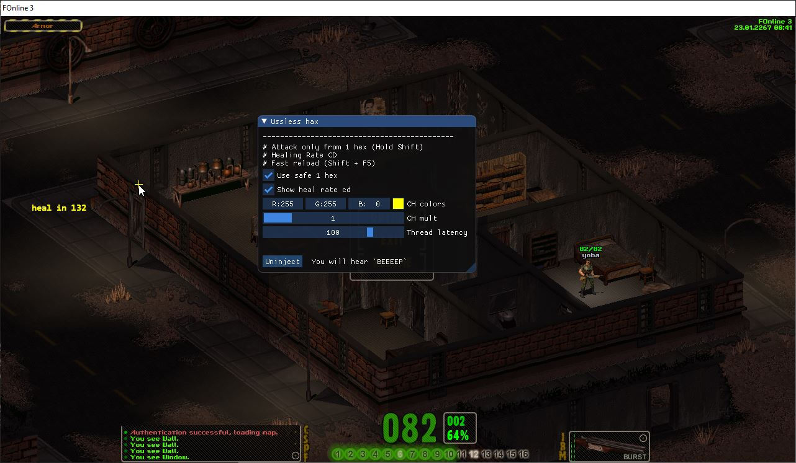

# FO3Hax
**Casual FOnline 3 ~~bullshit~~ soft**

Main features:
* Attack only from 1 hex
* Attack only from 1 hex (*safe version*)
* Healing Rate CD 
* Character stats
* Fast reload
* `Insert` - open/close gui

Meaning:

* Safe version means - After attack you character will be finding hex this way: range between you and target 2 hexes, between you and safe hex is 1
* To use 1 hex attack - hold `Shift`

Debug feature (comment defined var `RELEASE`):
* Gui log
* All incoming / outgoing packets
* Ability to send your packets

# GUI
